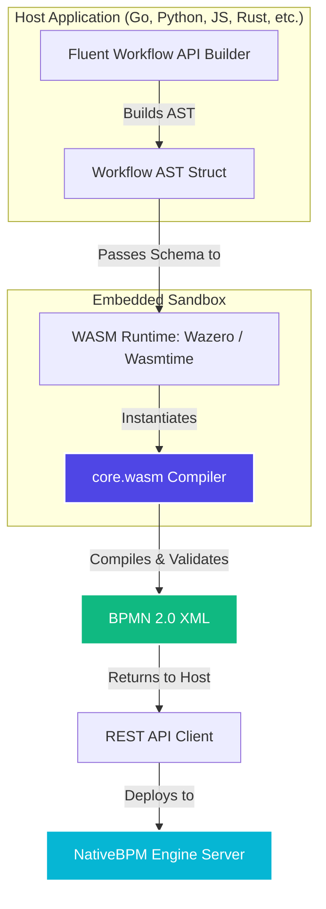

# NativeBPM Polyglot Client SDKs

  

Welcome to the official **NativeBPM Client SDKs** monorepo. NativeBPM is a cloud-native, high-performance BPMN 2.0 execution engine designed for modern microservice architectures. 

This repository houses the client libraries and Fluent Workflow builders for all major programming languages, allowing you to define, deploy, and interact with process definitions and human-in-the-loop tasks using your favorite language.

---

## 📖 API Documentation & Resources

* **Interactive Swagger UI**: Accessible at `http://localhost:8080/ui/docs` (choose topic *6. REST API Reference* inside your local NativeBPM Console).
* **Raw OpenAPI Specification**: Exposed dynamically by the engine at `http://localhost:8080/api/openapi.json`.
* **Central Repo Resources**:
  - [openapi.yaml](file:///Users/user/github.com/nativebpm/sdk/openapi.yaml): The platform OpenAPI 3.0 specification file.
  - [core.wasm](file:///Users/user/github.com/nativebpm/sdk/core.wasm): The pre-compiled WebAssembly Workflow-as-Code core builder.

---

## 🚀 Supported Languages

Click on the language badges below to navigate to their respective subdirectories and check out the documentation and runnable examples:

| Language | Badge | Quick Link |
| :--- | :--- | :--- |
| **Go** |  | [Go Client & Builder](./go) |
| **Python** |  | [Python Client & Builder](./python) |
| **TypeScript** |  | [TypeScript Client & Builder](./typescript) |
| **Java** |  | [Java Client & Builder](./java) |
| **.NET (C#)** |  | [.NET Client & Builder](./dotnet) |
| **PHP** |  | [PHP Client & Builder](./php) |
| **Rust** |  | [Rust Client & Builder](./rust) |

---

## 🛠️ WebAssembly-Powered Workflow-as-Code Compiler

NativeBPM features a state-of-the-art **Workflow-as-Code** builder. Instead of writing verbose BPMN 2.0 XML by hand or using external visual tools, developers can write type-safe, fluent code in their host language.

To ensure strict parity, identical schema output, and instant local validation across all 7 languages, NativeBPM compiles these code-defined ASTs using a single **embedded WebAssembly (WASM) core compiler** (`core.wasm`). 

### How it Works

Using lightweight runtimes like `wazero` in Go or `wasmtime` in Python, TypeScript, and Rust, the SDK loads and executes the compiled `core.wasm` binary in-memory. This guarantees:
* **Zero Host Dependencies**: No local CLI tools or external compilation services required.
* **Flawless parity**: The exact same BPMN validation and compilation logic runs identically on every platform.
* **Blazing speed**: Compilation and validation run in milliseconds, in-process.

---

## 🌟 Why NativeBPM Loves Your Language

Every language has its unique ecosystem, strengths, and philosophy. NativeBPM embraces this diversity and optimizes the developer experience for each stack:

### 🐹 Go (Golang)
* **Native Cohesion**: Since the core NativeBPM execution engine is written in Go, the Go client features direct and seamless integration.
* **Concurrency-First**: Take full advantage of Go's lightweight goroutines and channels to write high-concurrency topic workers.
* **Minimal Footprint**: Compiles into a single statically linked binary with absolute zero runtime dependencies.

### 🐍 Python
* **Outstanding Ergonomics**: Clear, readable syntax makes writing workflows as code feel natural and pleasant.
* **Rapid Prototyping**: Ideal for fast iterations, scripts, and startups.
* **AI & Agentic Ecosystem**: Python is the lingua franca of AI. NativeBPM's first-class `AITask` integrates beautifully with LangChain, LlamaIndex, and GenAI libraries.

### ⚡ TypeScript / JavaScript
* **Universal Reach**: Integrates natively with Node.js microservices, Edge runtimes, and frontend dashboards.
* **Asynchronous Mastery**: Fits perfectly within the JS async/await event-loop model for event-driven workflows.
* **Type Safety**: Full TypeScript typings for all REST APIs and workflow builders ensure autocomplete and compile-time correctness.

### ☕ Java
* **Enterprise Powerhouse**: Perfect for robust, long-running enterprise applications and high-throughput systems.
* **Strict Type Safety**: Protects complex orchestrations with Java's mature object-oriented compiler.
* **Familiar Migration**: Provides a modern, cloud-native migration path for legacy BPM (e.g. Camunda, Activiti) architectures.

### 💎 .NET (C#)
* **High Performance**: Native asynchronous tasks (`async/await`) and Linq integrations make backend execution extremely performant.
* **Premium Tooling**: Integrates natively with Visual Studio and the modern .NET Core / ASP.NET ecosystem.
* **Robust Enterprise Layout**: Type-safe client configurations and dependency injection patterns match enterprise architecture standards.

### 🐘 PHP
* **Web Native**: Perfect for PHP-centric applications, frameworks (like Laravel), and rapid-delivery web backends.
* **Simple Execution Model**: The straightforward, request-lifecycle PHP model makes queuing background tasks and invoking workflows highly intuitive.
* **Easy Integration**: Perfect for transactional backends that need process orchestration without complex microservice overhead.

### 🦀 Rust
* **Maximum Performance**: Zero runtime cost and zero-garbage-collector execution for absolute memory safety and speed.
* **Direct WASM Synergy**: Rust compiles to and interacts with WASM runtimes (like Wasmtime) with the highest possible efficiency.
* **Bulletproof Safety**: The compiler enforces strict ownership rules, preventing runtime data races in distributed workers.

---

## 📝 License

This project is licensed under the terms of the **Unlicense** (see individual directories for details).
