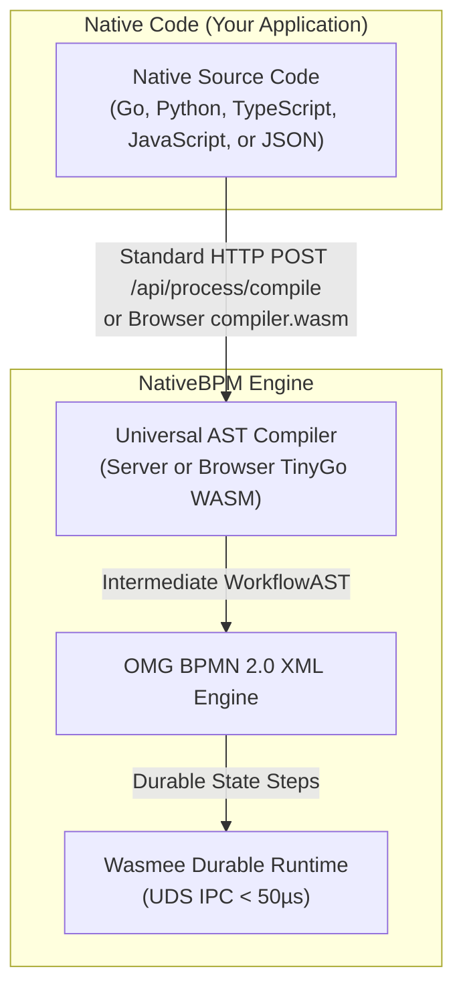

# NativeBPM Contracts & Native Code Integration Hub

  

Welcome to the **NativeBPM Contracts & Native Code Hub**. NativeBPM is a cloud-native, high-performance BPMN 2.0 / DMN 1.3 execution engine designed for modern distributed architectures.

---

## ⚡ The Single Integration Standard: Pure Native Code (Zero-SDK)

> [!IMPORTANT]
> **NativeBPM uses ONLY ONE integration variant: Native Code (Workflow-as-Code).**
> There are **no external SDK packages or vendor client libraries to install** (`npm install`, `pip install`, `go get`, Maven, NuGet, Cargo, Composer are never needed).

Instead of forcing developers into proprietary client wrappers and dependency lock-in, NativeBPM executes and compiles **idiomatic native code** directly on the server or via client-side WebAssembly:

```mermaid
flowchart TD
    subgraph "Native Code (Your Application)"
        CODE["Native Source Code<br/>(Go, Python, TypeScript, JavaScript, or JSON)"]
    end

    subgraph "NativeBPM Engine"
        COMPILER["Universal AST Compiler<br/>(Server or Browser TinyGo WASM)"]
        BPMN["OMG BPMN 2.0 XML Engine"]
        RUNTIME["Wasmee Durable Runtime<br/>(UDS IPC &lt; 50µs)"]
    end

    CODE -->|Standard HTTP POST /api/process/compile<br/>or Browser compiler.wasm| COMPILER
    COMPILER -->|Intermediate WorkflowAST| BPMN
    BPMN -->|Durable State Steps| RUNTIME
```

---

## 🌐 Native Code Support Across Languages

| Tier | Language | How It Works | External Packages Needed |
|---|---|---|:---:|
| **1. Native Workflow-as-Code** | **Go** | Write standard Go functions (`step.Run`, `form.Wait`, `for range`, `if/else`). Parsed natively with standard library `go/parser` & `go/ast` (`CGO_ENABLED=0`). | **0 (Zero)** |
| **1. Native Workflow-as-Code** | **Python** | Write async Python functions (`await step()`, `await form()`, `if/elif`, `try/except`). Parsed directly into BPMN 2.0 control flow. | **0 (Zero)** |
| **1. Native Workflow-as-Code** | **TypeScript / JavaScript** | Write native async/arrow functions. Parsed directly into AST by ECMA-262 visitor. | **0 (Zero)** |
| **2. Declarative State Machines** | **All Languages** (Java, C#, Rust, PHP, Ruby, Bash, C++, Kotlin, Swift, Dart) | Any language emits standard JSON State Machine structures (`steps`, `branches`, `timeout`, `retry`). Engine calculates BPMN auto-layout automatically. | **0 (Zero)** |
| **3. Sandboxed WASM Workers** | **Rust, C/C++, TinyGo, Zig** | High-performance workers compiled to WebAssembly run in Wasmee with Unix Domain Socket (UDS) IPC ($< 50\ \mu\text{s}$ SLA). | **0 (Zero)** |
| **4. Universal Standard HTTP / UDS** | **Any runtime or CLI** | Execute via built-in standard libraries (`net/http`, `urllib.request`, `fetch`, `HttpClient`, `curl`). | **0 (Zero)** |

---

## 📖 OpenAPI 3.0 Specification & Contracts

This repository maintains the authoritative API contracts for the NativeBPM platform:

* **OpenAPI 3.0 Specification**: [`api/openapi.yaml`](api/openapi.yaml)
  - `/api/process/compile`: Compile raw native code to BPMN 2.0 and optionally deploy/execute in a single call.
  - `/api/process/execute`: JIT auto-deploy and instant workflow execution.
  - `/api/instances`: Manage, inspect, and query process instances.
  - `/api/tasks`: Human-in-the-loop task completion.
* **JSON Schemas**: [`schema/`](schema/) — Declarative JSON schemas for workflow validation and dynamic UI forms.

---

## 📚 Native Code Integration Cookbook

For complete, copy-pasteable examples for any language using only standard built-in libraries, see the official **Zero-SDK Cookbook**:
🔗 **[Zero-SDK Cookbook on GitLab](https://gitlab.com/nativebpm/docs/-/blob/main/nativebpm/NB-284/zero_sdk_cookbook_ru.md)**

---

## 📝 License

This project is licensed under the terms of the **Unlicense**.
