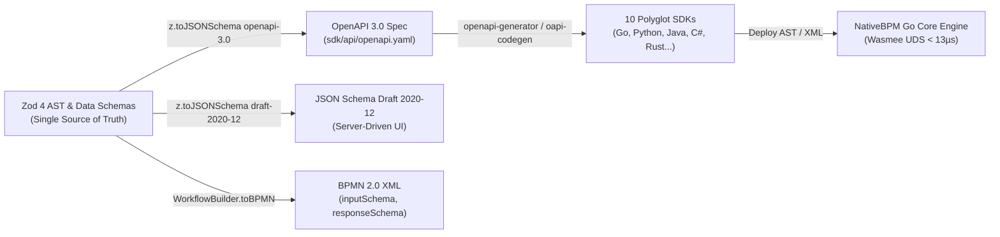

# NativeBPM Polyglot Client SDKs


<p align="center">
  <a href="https://gitlab.com/nativebpm/sdk">
    
  </a>
</p>

Welcome to the official **NativeBPM Client SDKs** monorepo. NativeBPM is a cloud-native, high-performance BPMN 2.0 execution engine designed for modern microservice architectures. 

This repository houses the client libraries and Fluent Workflow builders for all major programming languages, allowing you to define, deploy, and interact with process definitions and human-in-the-loop tasks using your favorite language.

---

## 📖 API Documentation & Resources

* **Interactive Swagger UI**: Accessible at `http://localhost:8080/ui/docs` (choose topic *6. REST API Reference* inside your local NativeBPM Console).
* **Raw OpenAPI Specification**: Exposed dynamically by the engine at `http://localhost:8080/api/openapi.json`.
* **Central Repo Resources**:
  - [openapi.yaml](api/openapi.yaml): The platform OpenAPI 3.0 specification file.

---

## 🚀 Supported Languages (Dedicated Branches)

To maintain clean dependency trees and isolate ecosystem-specific package managers, each programming language is maintained in its own dedicated Git branch. The `main` branch serves strictly as the central catalog containing the OpenAPI 3.0 specification (`api/openapi.yaml`) and the generator pipeline (`Makefile`).

Click on the links below to explore the SDK code, documentation, and packages in their respective branches:

| Language | Ecosystem | Branch | Direct Link |
| :--- | :--- | :--- | :--- |
| **Go** | Go Modules / oapi-codegen | `go` | [Go SDK & Builder](https://gitlab.com/nativebpm/sdk/-/tree/go) |
| **Python** | PyPI / setuptools | `python` | [Python SDK & Builder](https://gitlab.com/nativebpm/sdk/-/tree/python) |
| **TypeScript** | NPM / Fetch Client | `typescript` | [TypeScript SDK & Builder](https://gitlab.com/nativebpm/sdk/-/tree/typescript) |
| **Java** | Gradle / OkHttp-Gson | `java` | [Java SDK & Builder](https://gitlab.com/nativebpm/sdk/-/tree/java) |
| **.NET (C#)** | NuGet / .NET 9.0 | `dotnet` | [.NET Client & Builder](https://gitlab.com/nativebpm/sdk/-/tree/dotnet) |
| **PHP** | Composer / PHP 8.3 | `php` | [PHP SDK & Builder](https://gitlab.com/nativebpm/sdk/-/tree/php) |
| **Rust** | Cargo / Tokio | `rust` | [Rust SDK & Builder](https://gitlab.com/nativebpm/sdk/-/tree/rust) |
| **Kotlin** | Gradle / JVM-OkHttp4 | `kotlin` | [Kotlin SDK](https://gitlab.com/nativebpm/sdk/-/tree/kotlin) |
| **Swift** | Swift Package Manager | `swift` | [Swift SDK](https://gitlab.com/nativebpm/sdk/-/tree/swift) |
| **Dart / Flutter** | Pub / Dart & Flutter | `dart` | [Dart & Flutter SDK & Builder](https://gitlab.com/nativebpm/sdk/-/tree/dart) |

---

## ⚡ Universal Contract Architecture: Zod 4 + OpenAPI 3.0 = JSON Schema = BPMN 2.0

NativeBPM employs an end-to-end **Schema-as-Code** pipeline anchored by **Zod 4**:
* **Single Source of Truth (SSOT)**: Workflow AST graphs and data contracts are declared in TypeScript via Zod 4 (`schema/src/index.ts`) in the `main` branch.
* **Multi-Target Native Compilation**: Zod 4 natively compiles schemas without third-party dependencies to:
  1. **OpenAPI 3.0.3 Specification Document** (`target: 'openapi-3.0'`) — exported to `api/schemas/workflow-ast.openapi.json` (featuring a standalone OpenAPI 3.0.3 document with live Swagger UI interactive preview on GitLab) and embedded into `api/openapi.yaml` to generate strongly typed models across all 10 language SDKs.
  2. **JSON Schema Draft 2020-12** (`target: 'draft-2020-12'`) — exported to `api/schemas/workflow-ast.schema.json` to drive Server-Driven UI (BDUI) and dynamic form rendering in `<nativebpm-trigger>` web components.
* **Two-Way Re-hydration (`fromJSONSchema`)**: Enables frontend applications to reconstruct live, executable Zod validators directly from JSON Schemas delivered over the wire.
* **OMG BPMN 2.0 Parity**: The NativeBPM Go core engine accepts AST directly and serializes standard BPMN 2.0 XML with `inputSchema` and `nativebpm:responseSchema` extensions.


```mermaid
flowchart LR
    ZOD["Zod 4 AST & Data Schemas<br/>(Single Source of Truth)"] -->|z.toJSONSchema openapi-3.0| OAI["OpenAPI 3.0 Spec<br/>(sdk/api/openapi.yaml)"]
    ZOD -->|z.toJSONSchema draft-2020-12| JS["JSON Schema Draft 2020-12<br/>(Server-Driven UI)"]
    OAI -->|openapi-generator / oapi-codegen| SDK["10 Polyglot SDKs<br/>(Go, Python, Java, C#, Rust...)"]
    ZOD -->|WorkflowBuilder.toBPMN| BPMN["BPMN 2.0 XML<br/>(inputSchema, responseSchema)"]
    SDK -->|Deploy AST / XML| ENGINE["NativeBPM Go Core Engine<br/>(Wasmee UDS < 13µs)"]
```

### 7 Modular AST Zod Schemas
1. **`WorkflowASTSchema`** — root process container (`id`, `name`, `inputSchema`, `nodes`, `flows`).
2. **`NodeASTSchema`** — unified schema covering 12 BPMN 2.0 node types (`serviceTask`, `userTask`, `aiTask`, `exclusiveGateway`, `boundaryTimerEvent`...).
3. **`FlowASTSchema`** — sequence flows with JUEL/FEEL condition expressions.
4. **`DMNRuleSchema`** — decision matrix rows (`inputs: string[]`, `outputs: string[]`).
5. **`DMNInputSchema` & `DMNOutputSchema`** — DMN column type definitions.
6. **`InVariableSchema` & `OutVariableSchema`** — callActivity subprocess variable mapping.

### Shortened Branching Fluent API (`when ... then ... otherwise`)
Decision gateways (`exclusiveGateway`) are synthesized automatically behind the scenes:

```typescript
const workflow = new WorkflowBuilder('order_flow', 'Order Processing')
  .variables(OrderInputSchema) // Process start variables contract
  .start('start')
  .serviceTask('score', 'Score Order', 'scoring_topic')
  // Automatically creates and connects exclusiveGateway:
  .when("score > 80")
    .then('vip_review')
    .userTask('vip_review', 'VIP Review', { form: VIPFormSchema })
    .boundaryTimer('sla_timer', 'SLA 15M', 'PT15M') // ISO 8601 validated via z.iso.duration()
  .otherwise('auto_approve')
    .serviceTask('auto_approve', 'Auto Approval', 'payout_topic')
  .end('end', 'Done');
```

---

## 🛠️ Server-side Workflow-as-Code Compilation

NativeBPM features a state-of-the-art **Workflow-as-Code** builder. Instead of writing verbose BPMN 2.0 XML by hand or using external visual tools, developers can write type-safe, fluent code in their host language.

To ensure client-side SDKs remain extremely lightweight, reliable, and free of heavy runtime dependencies (like WASM runtimes or local binary files), the compilation logic has been moved entirely to the server side. 

### How it Works

```mermaid
flowchart TD
    subgraph "Host Application (Go, Python, TypeScript, Rust, Swift, etc.)"
        API[Fluent Workflow API Builder] -->|Builds AST| AST[Workflow AST JSON]
        AST -->|Single Call: workflow.run / POST /api/process/execute| REST[REST API Client]
    end

    subgraph "NativeBPM Engine Server"
        POST_EXEC[POST /api/process/execute] -->|Checks contentHash in DB| HASH_CHECK{Hash Exists?}
        HASH_CHECK -- "No (Cold Path)" --> COMPILER[Embedded Go-in-WASM Compiler]
        COMPILER -->|Compiles & Stores Definition| BPMN[BPMN 2.0 XML]
        BPMN -->|Auto-deploys & Starts Instance| ENGINE[Execution Engine]
        HASH_CHECK -- "Yes (Hot Path)" --> ENGINE
    end

    REST -->|Sends { definitionId, contentHash, variables }| POST_EXEC

    style COMPILER fill:#4F46E5,stroke:#fff,stroke-width:2px,color:#fff
    style BPMN fill:#10B981,stroke:#fff,stroke-width:2px,color:#fff
    style ENGINE fill:#06B6D4,stroke:#fff,stroke-width:2px,color:#fff
```

### 🚀 Just-In-Time (JIT) Auto-Deploy & Single-Call Execution (`workflow.run()`)

Traditionally, workflow systems require a two-step ceremony: first registering the diagram (`POST /api/deploy`), then initiating execution (`POST /api/definitions/{id}/start`). 

NativeBPM eliminates this overhead with **Just-In-Time (JIT) Auto-Deploy** via `POST /api/process/execute`:
* **Single-Line Invocation**:
  ```typescript
  // Cold start auto-deploys; hot start runs with zero re-deployment overhead!
  const instance = await orderWorkflow.run({ orderId: "12345", amount: 499 });
  console.log(`Started process instance ${instance.id} (status: ${instance.state})`);
  ```
* **Deterministic SHA-256 Content Hashing**: Each workflow AST computes a canonical JSON hash (`sha256:...`).
* **Hot-Path Zero-AST Transmission**: Once deployed, the client caches the hash and transmits only `{ definitionId, contentHash, variables }`, reducing payload size by over 90%.
* **Self-Healing Transparent Fallback**: If the server clears its cache or an unknown hash error (HTTP 404 `DEFINITION_HASH_UNKNOWN`) is returned, the client automatically re-transmits the full definition without breaking the application logic.

By offloading the compilation to the engine backend, NativeBPM client SDKs require:
* **Zero Client Dependencies**: No WebAssembly interpreters (like Wazero or Wasmtime) or local `.wasm` files are bundled.
* **Flawless Stability**: Platform updates and schema validations are maintained server-side, meaning client SDKs do not need updates for compiler upgrades.
* **App Store Policy Compliance**: Perfect for mobile platforms (iOS/macOS via Swift, Android via Kotlin) which strictly restrict JIT execution and arbitrary binary execution.

---

## 🌟 Why NativeBPM Loves Your Language

Every language has its unique ecosystem, strengths, and philosophy. NativeBPM embraces this diversity and optimizes the developer experience for each stack:

### 🐹 Go (Golang)
* **Native Cohesion**: Since the core NativeBPM execution engine is written in Go, the Go client features direct and seamless integration.
* **Concurrency-First**: Take full advantage of Go's lightweight goroutines and channels to write high-concurrency topic workers.
* **Minimal Footprint**: Compiles into a single statically linked binary with absolute zero runtime dependencies.
* **Full Contract Code-Gen**: Generates both the client library and server-side boilerplate interfaces (`StrictServerInterface`) dynamically from the OpenAPI contract.

### 🐍 Python
* **Outstanding Ergonomics**: Clear, readable syntax makes writing workflows as code feel natural and pleasant.
* **Rapid Prototyping**: Ideal for fast iterations, scripts, and startups.
* **AI & Agentic Ecosystem**: Python is the lingua franca of AI. NativeBPM's first-class `AITask` integrates beautifully with LangChain, LlamaIndex, and GenAI libraries.

### ⚡ TypeScript / JavaScript
* **Universal Reach**: Integrates natively with Node.js microservices, Edge runtimes, and frontend dashboards.
* **Asynchronous Mastery**: Fits perfectly within the JS async/await event-loop model for event-driven workflows.
* **Type Safety**: Full TypeScript typings for all REST APIs and workflow builders ensure autocomplete and compile-time correctness.

### ☕ Java
* **Enterprise Powerhouse**: Perfect for robust, long-running enterprise applications and high-throughput systems.
* **Strict Type Safety**: Protects complex orchestrations with Java's mature object-oriented compiler.
* **Familiar Migration**: Provides a modern, cloud-native migration path for legacy BPM (e.g. Camunda, Activiti) architectures.

### 💎 .NET (C#)
* **High Performance**: Native asynchronous tasks (`async/await`) and Linq integrations make backend execution extremely performant.
* **Premium Tooling**: Integrates natively with Visual Studio and the modern .NET Core / ASP.NET ecosystem.
* **Robust Enterprise Layout**: Type-safe client configurations and dependency injection patterns match enterprise architecture standards.

### 🐘 PHP
* **Web Native**: Perfect for PHP-centric applications, frameworks (like Laravel), and rapid-delivery web backends.
* **Simple Execution Model**: The straightforward, request-lifecycle PHP model makes queuing background tasks and invoking workflows highly intuitive.
* **Easy Integration**: Perfect for transactional backends that need process orchestration without complex microservice overhead.

### 🦀 Rust
* **Maximum Performance**: Zero runtime cost and zero-garbage-collector execution for absolute memory safety and speed.
* **Direct WASM Synergy**: Rust compiles to and interacts with WASM runtimes (like Wasmtime) with the highest possible efficiency.
* **Bulletproof Safety**: The compiler enforces strict ownership rules, preventing runtime data races in distributed workers.

### 🚀 Kotlin (Android / JVM)
* **Mobile & Backend Ready**: Native Kotlin REST client, perfect for Android apps, backend microservices, or Kotlin Multiplatform projects.
* **Modern Concurrency**: Built with OkHttp and coroutines compatibility for lightweight asynchronous requests.
* **Clean Syntax**: Elegant Kotlin properties and builders that map directly to the platform API.

### 🍎 Swift (iOS / macOS)
* **Native Apple Integration**: Native Swift implementation using URLSession and modern async/await for smooth integration into iOS, macOS, or watchOS apps.
* **Strict Type Safety**: Fully compatible with Swift Codable schemas and AnyCodable variables, avoiding JSON deserialization issues.
* **Lightweight Bundle**: REST-only client, avoiding WebAssembly and runtime overhead to keep your mobile application binary size tiny.

### 🎯 Dart / Flutter
* **Mobile & Cross-Platform Ready**: Statically typed Dart client, optimized for Flutter apps running on iOS, Android, Web, or Desktop.
* **Declarative Workflow Builder**: Full support for the Fluent API, including conditional branching using `.when().then().Else()` and automatic back-edge loops tracking.
* **AOT Compilation Friendly**: Zero dependency footprint, avoiding WASM runtimes to comply with strict iOS AOT and app store execution policies.

---

## 🤖 AI Service Task Integration (`aiServiceTask`)

To facilitate seamless AI and LLM orchestration without breaking BPMN 2.0 standards:
* Every client SDK provides a fluent `.AITask(...)` (or `.ai()`) helper.
* Under the hood, this compiles into a standard BPMN `<serviceTask>` element with the type `"aiServiceTask"` and topic `"ai_assistant"`.
* System instructions, prompts, and target schemas are automatically serialized into `<extensionElements>` (matching standard Camunda input/output structures).
* This keeps your process schemas fully compatible with standard BPMN 2.0 visual modelers while giving your developers a clean, type-safe API wrapper.

---

## ⚙️ Polyglot SDK Development & Code Generation (BuildKit)

All client libraries are generated hermetically from the central OpenAPI 3.0 specification ([api/openapi.yaml](api/openapi.yaml)) using **Docker BuildKit (`docker buildx`)**. This eliminates host environment dependencies, runs parallel multi-stage generation across all CPU cores, and writes files with user-mapped permissions.

### Generate All 10 Languages in Parallel
```bash
make generate
# Or directly via buildx:
docker buildx build -f Dockerfile.gen --target export-all --output type=local,dest=./out .
```

### Generate a Specific Language
```bash
make generate-go
make generate-typescript
make generate-python
# Or override destination directory:
make generate-go DEST=./go
```

### 100% Docker-Based Host-Free Development
Every single target in the `Makefile` runs inside standardized Docker containers without requiring local host language runtimes (`node`, `go`, `python`, `gradle`, etc.):
```bash
# Validate Zod 4 contracts inside Docker
make test-schema

# Export OpenAPI 3.0.3 and JSON Schema inside Docker
make schemas

# Run all polyglot tests in isolated Docker containers
make test
```

For detailed instructions on modifying API schemas, regenerating individual language SDKs, and running test suites, please refer to the [Contributing Guide](CONTRIBUTING.md).

---

## 📝 License

This project is licensed under the terms of the **Unlicense** (see individual directories for details).
