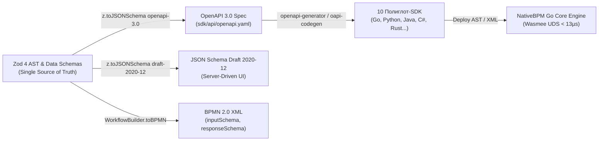
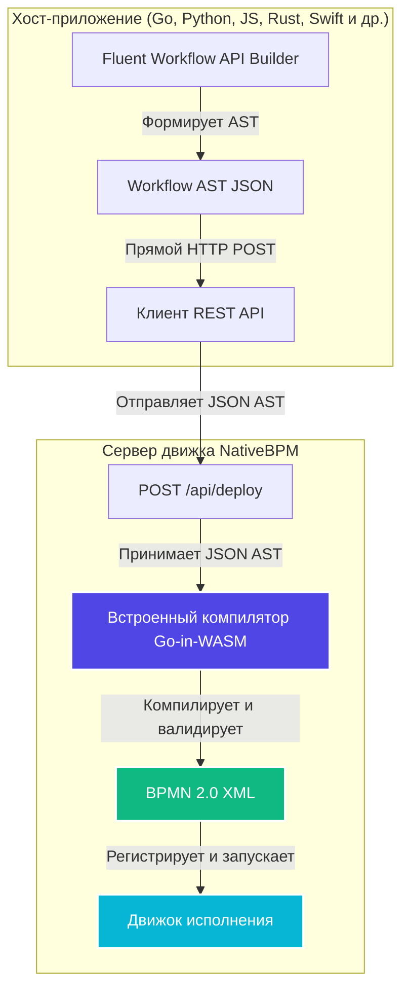

# Мультиязычные клиентские SDK для NativeBPM

<p align="center">
  <a href="https://gitlab.com/nativebpm/sdk">
    
  </a>
</p>

Добро пожаловать в официальный монорепозиторий **клиентских SDK для NativeBPM**. NativeBPM — это облачный высокопроизводительный движок исполнения процессов BPMN 2.0, спроектированный для современных микросервисных архитектур.

В этом репозитории собраны клиенты и Fluent API конструкторы для всех популярных языков программирования. Вы можете описывать, развертывать схемы и взаимодействовать с инцидентами и пользовательскими задачами на своем любимом языке.

---

## 📖 Документация API и ресурсы

* **Интерактивный Swagger UI**: Доступен по адресу `http://localhost:8080/ui/docs` (выберите тему *6. REST API Reference* во встроенной панели управления NativeBPM).
* **Спецификация OpenAPI (JSON)**: Динамически отдается движком по адресу `http://localhost:8080/api/openapi.json`.
* **Центральные ресурсы репозитория**:
  - [openapi.yaml](api/openapi.yaml): Файл спецификации OpenAPI 3.0 платформы.

---

## 🚀 Поддерживаемые языки

Нажмите на бейдж интересующего вас языка, чтобы перейти в соответствующую папку с документацией и готовыми примерами кода:

| Язык | Бейдж | Быстрая ссылка |
| :--- | :--- | :--- |
| **Go** |  | [Клиент и конструктор Go](./go) |
| **Python** |  | [Клиент и конструктор Python](./python) |
| **TypeScript** |  | [Клиент и конструктор TypeScript](./typescript) |
| **Java** |  | [Клиент и конструктор Java](./java) |
| **.NET (C#)** |  | [Клиент и конструктор .NET](./dotnet) |
| **PHP** |  | [Клиент и конструктор PHP](./php) |
| **Rust** |  | [Клиент и конструктор Rust](./rust) |
| **Kotlin** |  | [Клиент Kotlin](./kotlin) |
| **Swift** |  | [Клиент Swift](./swift) |
| **Dart / Flutter** |  | [Клиент и конструктор Dart & Flutter](./dart) |

---

## ⚡ Архитектура контрактов: Zod 4 + OpenAPI 3.0 = JSON Schema = BPMN 2.0

В монорепозитории реализован сквозной конвейер **Schema-as-Code** на базе **Zod 4**:
* **Единый первоисточник (Single Source of Truth)**: Контракты графа процессов (Workflow AST) и данных описываются на TypeScript с помощью Zod 4 (`sdk/typescript/src/schemas/workflow-ast.ts`).
* **Мульти-таргетная компиляция**: Zod 4 нативно компилирует схемы в:
  1. **OpenAPI 3.0** (`target: 'openapi-3.0'`) — внедряется в `sdk/api/openapi.yaml` для генерации типизированных клиентов на 10 языков.
  2. **JSON Schema Draft 2020-12** (`target: 'draft-2020-12'`) — используется для динамического рендеринга форм Server-Driven UI (BDUI) в веб-виджетах `<nativebpm-trigger>`.
* **Двусторонняя регидратация (`fromJSONSchema`)**: Позволяет веб-компонентам и фронтенду в одну строчку восстанавливать исполняемые валидаторы Zod из JSON Schema, полученной от сервера.
* **OMG BPMN 2.0 Parity**: Движок NativeBPM на Go нативно принимает AST с сохранением спецификаций `inputSchema` и `nativebpm:responseSchema`.



### 7 системных Zod-компонентов AST
1. **`WorkflowASTSchema`** — корневой контейнер процесса (`id`, `name`, `inputSchema`, `nodes`, `flows`).
2. **`NodeASTSchema`** — единая типизированная схема для 12 типов BPMN-элементов (`serviceTask`, `userTask`, `aiTask`, `exclusiveGateway`, `parallelGateway`, `boundaryTimerEvent`...).
3. **`FlowASTSchema`** — sequence flow с условиями JUEL/FEEL.
4. **`DMNRuleSchema`** — строки матрицы решений DMN (`inputs: string[]`, `outputs: string[]`).
5. **`DMNInputSchema` & `DMNOutputSchema`** — колонки таблицы решений.
6. **`InVariableSchema` & `OutVariableSchema`** — маппинг контекста подпроцессов `callActivity`.

### Укороченный Fluent API (`when ... then ... otherwise`)
Конструктор позволяет строить ветвления максимально компактно — шлюз `exclusiveGateway` создаётся автоматически:

```typescript
const workflow = new WorkflowBuilder('order_flow', 'Обработка заказов')
  .variables(OrderInputSchema) // Строгий контракт входных данных процесса
  .start('start')
  .serviceTask('score', 'Скоринг заказа', 'scoring_topic')
  // Шлюз exclusiveGateway генерируется автоматически:
  .when("score > 80")
    .then('vip_review')
    .userTask('vip_review', 'VIP Проверка', { form: VIPFormSchema })
    .boundaryTimer('sla_timer', 'SLA 15M', 'PT15M') // Валидация ISO 8601 через z.iso.duration()
  .otherwise('auto_approve')
    .serviceTask('auto_approve', 'Автоодобрение', 'payout_topic')
  .end('end', 'Завершено');
```

---

## 🛠️ Серверная компиляция Workflow-as-Code

NativeBPM предоставляет передовой конструктор **Workflow-as-Code**. Вместо ручного написания громоздких XML-файлов BPMN 2.0 или использования сторонних визуальных редакторов, разработчики могут писать типизированный и лаконичный код на основном языке приложения.

Чтобы сделать клиентские SDK максимально легкими, надежными и освободить их от тяжелых рантайм-зависимостей (таких как WASM-интерпретаторы или файлы скомпилированных модулей), логика компиляции была полностью перенесена на сторону сервера NativeBPM.

### Схема работы



Благодаря переносу компиляции на бэкенд движка, клиентские SDK NativeBPM получили следующие преимущества:
* **Нулевые зависимости на клиенте**: В SDK больше не встраиваются интерпретаторы WebAssembly (такие как Wazero или Wasmtime) или локальные файлы `.wasm`.
* **Абсолютная стабильность**: Обновления платформы и валидации схем происходят на сервере, поэтому клиентские SDK не требуют обновления при изменении компилятора.
* **Соответствие правилам App Store**: Идеально подходит для мобильных платформ (iOS/macOS через Swift, Android через Kotlin), которые строго ограничивают JIT-компиляцию и выполнение сторонних бинарных файлов.

---

## 🌟 Почему NativeBPM ценит ваш язык

Каждый язык программирования обладает уникальной экосистемой, сильными сторонами и философией. NativeBPM уважает это разнообразие и адаптирует опыт разработки под каждый стек:

### 🐹 Go (Golang)
* **Нативная интеграция**: Поскольку ядро движка NativeBPM написано на Go, клиент для Go обеспечивает максимально плотную и прямую интеграцию.
* **Эффективная многопоточность**: Полноценное использование легковесных горутин (goroutines) и каналов Go для создания высокопроизводительных обработчиков топиков (topic workers).
* **Минимальный размер**: Приложение компилируется в один статически связанный бинарный файл без каких-либо внешних рантайм-зависимостей.
* **Генерация полного контракта**: Помимо клиентской библиотеки, на основе контракта OpenAPI автоматически генерируется серверный интерфейс (`StrictServerInterface`) и вся необходимая роутинговая обвязка.

### 🐍 Python
* **Превосходная эргономика**: Чистый и читаемый синтаксис делает написание рабочих процессов в виде кода естественным и приятным.
* **Быстрое прототипирование**: Идеальное решение для быстрых итераций, стартапов и автоматизации.
* **Экосистема ИИ и агентов**: Python — главный язык для работы с искусственным интеллектом. Первоклассная задача `AITask` в NativeBPM нативно интегрируется с LangChain, LlamaIndex и библиотеками генеративного ИИ.

### ⚡ TypeScript / JavaScript
* **Универсальность**: Нативная поддержка микросервисов Node.js, сред исполнения Edge и веб-панелей управления.
* **Асинхронное превосходство**: Идеально ложится на модель async/await и цикл событий (event loop) для построения событийно-ориентированных процессов.
* **Строгая типизация**: Полные типы TypeScript для всех REST API и конструкторов обеспечивают автодополнение в IDE и защиту от ошибок компиляции.

### ☕ Java
* **Корпоративный стандарт**: Идеально подходит для надежных, долгоживущих корпоративных систем с высокими нагрузками.
* **Надежность компиляции**: Java-компилятор и строгая типизация защищают сложные цепочки оркестрации бизнес-логики.
* **Простой переход**: Современная облачная альтернатива для команд, мигрирующих со старых BPMN-систем (например, Camunda, Activiti).

### 💎 .NET (C#)
* **Высокая производительность**: Нативная поддержка асинхронности (`async/await`) и интеграции Linq делают исполнение логики на бэкенде исключительно быстрым.
* **Элитный инструментарий**: Нативная поддержка Visual Studio и современной экосистемы .NET Core / ASP.NET.
* **Архитектурная чистота**: Паттерны внедрения зависимостей (Dependency Injection) и конфигурации клиента соответствуют жестким корпоративным стандартам.

### 🐘 PHP
* **Ориентация на веб**: Идеальный выбор для приложений и фреймворков (таких как Laravel) с быстрыми циклами разработки.
* **Простая модель исполнения**: Жизненный цикл запроса в PHP делает запуск бэкграунд-процессов и фоновых воркеров очень простым и предсказуемым.
* **Быстрый старт**: Отличное решение для бэкендов, которым нужна надежная оркестрация процессов без необходимости развертывания сложной микросервисной архитектуры.

### 🦀 Rust
* **Максимальная эффективность**: Отсутствие накладных расходов во время выполнения (zero-cost abstractions) и отсутствие сборщика мусора гарантируют предсказуемую скорость.
* **Нативная синергия с WASM**: Rust взаимодействует с WASM-рантаймом (через Wasmtime) с наивысшей производительностью и минимальным потреблением памяти.
* **Гарантированная безопасность**: Компилятор предотвращает состояние гонки (data races) при параллельной обработке задач распределенными воркерами.

### 🚀 Kotlin (Android / JVM)
* **Готов к мобильной и бэкенд разработке**: Нативный клиент REST на Kotlin, идеально подходящий для приложений под Android, бэкенд-микросервисов или проектов Kotlin Multiplatform.
* **Современная асинхронность**: Построен на базе OkHttp с легкой интеграцией с корутинами (Coroutines) для эффективного выполнения запросов.
* **Лаконичный синтаксис**: Элегантные свойства Kotlin и fluent-билдеры, напрямую сопоставимые с API платформы.

### 🍎 Swift (iOS / macOS)
* **Нативная интеграция Apple**: Реализация на чистом Swift с использованием URLSession и современного механизма async/await для бесшовной интеграции в приложения для iOS, macOS или watchOS.
* **Строгая типизация**: Полная совместимость со схемами Swift Codable и типом AnyCodable для безопасной работы с переменными без проблем с сериализацией JSON.
* **Легковесный размер**: Исключительно REST-клиент без оверхеда на WebAssembly, что сохраняет размер бинарного файла вашего мобильного приложения минимальным.

### 🎯 Dart / Flutter
* **Готов к мобильной и кроссплатформенной разработке**: Статически типизированный клиент Dart, оптимизированный для приложений Flutter под iOS, Android, Web или Desktop.
* **Декларативный конструктор**: Полная поддержка Fluent API, включая условные переходы через `.when().then().Else()` и автоопределение циклов выполнения.
* **Совместимость с AOT**: Отсутствие внешних зависимостей и оверхеда на WASM-среду выполнения для полного соответствия строгим политикам AOT-компиляции и модерации в App Store и Google Play.

---

## 🤖 Интеграция с ИИ через Сервисные Задачи (`aiServiceTask`)

Для бесшовной интеграции с LLM и ИИ-ассистентами без нарушения стандартов BPMN 2.0:
* Каждый SDK предоставляет удобный метод-обертку `.AITask(...)` (или `.ai()`).
* Под копотом этот метод компилирует шаг в стандартный BPMN-элемент `<serviceTask>` с типом `"aiServiceTask"` и топиком `"ai_assistant"`.
* Системные инструкции, промпты и схемы ответов сериализуются в тег `<extensionElements>` (соответствуя стандартной структуре параметров ввода/вывода).
* Это сохраняет ваши схемы процессов на 100% совместимыми со стандартными визуальными редакторами BPMN 2.0, предоставляя разработчикам чистый и типизированный API.

---

## ⚙️ Разработка SDK и кодогенерация в монорепозитории

Все клиентские библиотеки в этом монорепозитории генерируются напрямую из центральной спецификации OpenAPI 3.0 ([api/openapi.yaml](api/openapi.yaml)).

Для перегенерации кода на всех 10 языках:
```bash
make generate
```

Подробные инструкции по модификации схем API, генерации SDK для отдельных языков и выполнению тестовых наборов смотрите в [Руководстве разработчика (Contributing Guide)](CONTRIBUTING_ru.md).

---

## 📝 Лицензия

Этот проект распространяется под лицензией **Unlicense** (подробности ищите в соответствующих подпапках языков).
