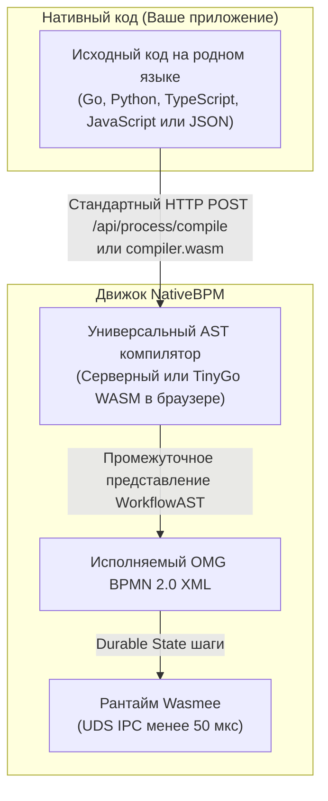

# Спецификации контрактов OpenAPI и нативная интеграция NativeBPM

  

Добро пожаловать в репозиторий **контрактов OpenAPI и нативной интеграции NativeBPM**. NativeBPM — это облачный высокопроизводительный движок исполнения процессов BPMN 2.0 / DMN 1.3, спроектированный для современных распределенных микросервисных архитектур.

---

## ⚡ Единственный стандарт интеграции: Нативный код (Zero-SDK)

> [!IMPORTANT]
> **В NativeBPM действует только один вариант интеграции: Нативный код (Workflow-as-Code).**
> В платформе **нет внешних клиентских библиотек или вендорских SDK-пакетов для установки** (`npm install`, `pip install`, `go get`, зависимости в Maven, NuGet, Cargo или Composer больше никогда не требуются).

Вместо принуждения разработчиков к проприетарным клиентским библиотекам и зависимостям, NativeBPM компилирует и исполняет **идиоматичный нативный код** напрямую на сервере или через WebAssembly в браузере:

---

## 🌐 Поддержка нативного кода по языкам программирования

| Уровень | Язык | Принцип работы | Внешние пакеты |
|---|---|---|:---:|
| **1. Нативный Workflow-as-Code** | **Go** | Обычные функции на Go (`step.Run`, `form.Wait`, `for range`, `if/else`). Парсинг стандартной библиотекой `go/parser` и `go/ast` (`CGO_ENABLED=0`). | **0 (Zero)** |
| **1. Нативный Workflow-as-Code** | **Python** | Асинхронные функции (`await step()`, `await form()`, `if/elif`, `try/except`). Парсинг напрямую в граф потока управления BPMN 2.0. | **0 (Zero)** |
| **1. Нативный Workflow-as-Code** | **TypeScript / JavaScript** | Нативные функции и стрелочные выражения. Парсинг визитором ECMA-262 в WorkflowAST. | **0 (Zero)** |
| **2. Декларативные State Machines** | **Все языки** (Java, C#, Rust, PHP, Ruby, Bash, C++, Kotlin, Swift, Dart) | Любой язык формирует стандартный JSON State Machine (`steps`, `branches`, `timeout`, `retry`). Движок автоматически рассчитывает координаты схемы BPMN. | **0 (Zero)** |
| **3. Изолированные WASM воркеры** | **Rust, C/C++, TinyGo, Zig** | Высокопроизводительные воркеры, скомпилированные в WebAssembly, исполняются в Wasmee через Unix Domain Sockets (SLA &lt; 50 мкс). | **0 (Zero)** |
| **4. Стандартный HTTP / UDS** | **Любой рантайм или CLI** | Вызовы через встроенные стандартные библиотеки (`net/http`, `urllib.request`, `fetch`, `HttpClient`, `curl`). | **0 (Zero)** |

---

## 📖 Спецификация OpenAPI 3.0 и схемы контрактов

Этот репозиторий содержит официальные спецификации контрактов платформы NativeBPM:

* **Спецификация OpenAPI 3.0**: [`api/openapi.yaml`](api/openapi.yaml)
  - `/api/process/compile`: Компиляция нативного кода в BPMN 2.0 и опциональный запуск процесса за один вызов.
  - `/api/process/execute`: JIT-автодеплой и мгновенное выполнение воркфлоу.
  - `/api/instances`: Управление, инспекция и мониторинг экземпляров процессов.
  - `/api/tasks`: Завершение пользовательских задач (Human-in-the-loop).
* **Схемы JSON Schema**: [`schema/`](schema/) — Декларативные схемы для валидации процессов и форм Server-Driven UI.

---

## 📚 Сборник рецептов нативного кода (Cookbook)

Готовые к использованию примеры кода для каждого языка со стандартными библиотеками доступны в официальном руководстве:
🔗 **[Zero-SDK Cookbook в GitLab](https://gitlab.com/nativebpm/docs/-/blob/main/nativebpm/NB-284/zero_sdk_cookbook_ru.md)**

---

## 📝 Лицензия

Проект распространяется на условиях лицензии **Unlicense**.
